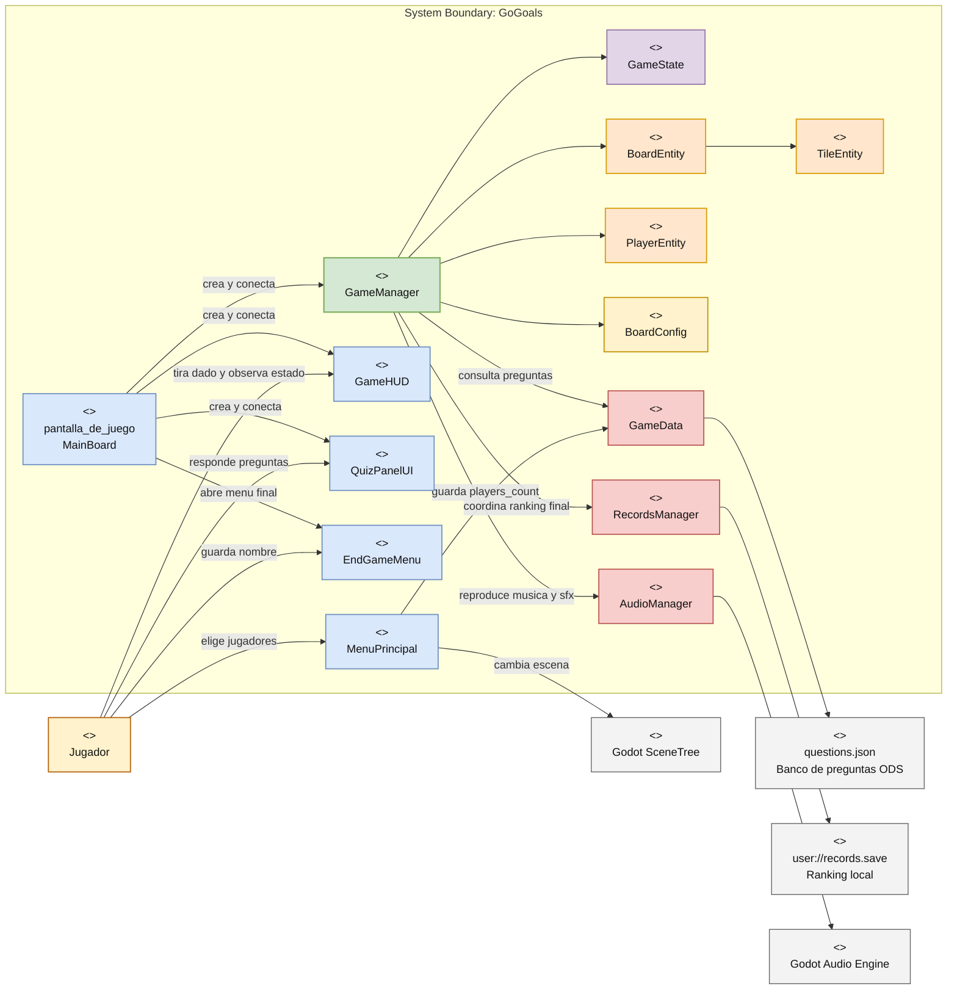

# Arquitectura del juego GoGoals

Este documento resume el contexto del sistema, el flujo principal de juego y las caracteristicas del patron arquitectonico que hoy gobierna el proyecto.

## 1. Resumen ejecutivo

El juego no usa un MVC puro ni una Clean Architecture estricta. La forma mas precisa de describirlo es:

**Arquitectura scene-driven modular con servicios globales (autoload), entidades ligeras y un coordinador central de aplicacion.**

En terminos practicos:

- Las escenas de Godot siguen marcando los limites de navegacion y presentacion.
- `MainBoard` funciona como composition root de la escena de juego.
- `GameManager` coordina la partida y concentra los casos de uso principales.
- `GameState` conserva el estado mutable de la sesion.
- `BoardEntity`, `TileEntity` y `PlayerEntity` representan el dominio del tablero.
- `GameHUD` y `QuizPanelUI` encapsulan la interfaz.
- `GameData`, `RecordsManager` y `AudioManager` actuan como servicios globales.

## 2. Diagrama contextual

El siguiente diagrama esta escrito en Mermaid, pero esta organizado para verse como un diagrama contextual tipo Visual Paradigm: actores afuera, limite del sistema al centro y servicios externos alrededor.

### Diagrama de componentes en imagen

La siguiente version presenta la arquitectura como diagrama de componentes, con estilo visual mas cercano a una herramienta UML como Visual Paradigm.

## 3. Flujo contextual de una partida

### 3.1 Entrada al sistema

1. `MenuPrincipal` inicia la interaccion.
2. El jugador selecciona la cantidad de participantes.
3. El dato se guarda en `GameData.players_count`.
4. El `SceneTree` cambia a la escena `pantalla_de_juego`.

### 3.2 Ensamblaje de la escena principal

1. `MainBoard` se carga como root de la escena jugable.
2. `MainBoard` instancia `GameManager`.
3. `MainBoard` instancia `GameHUD`.
4. `MainBoard` instancia `QuizPanelUI`.
5. `MainBoard` conecta las señales entre UI y logica.
6. `MainBoard` invoca `GameManager.initialize_game(...)`.

### 3.3 Inicializacion de la partida

1. `GameManager` crea `BoardEntity`.
2. `BoardEntity` toma las casillas del escenario y las transforma en `TileEntity`.
3. `BoardConfig` aporta las reglas fijas del tablero:
   - escaleras
   - bajadas
   - casillas quiz
4. `GameState` reinicia:
   - tiempo
   - jugador activo
   - posiciones
   - conteo de turnos
5. `GameManager` instancia un `PlayerEntity` por jugador.
6. `AudioManager` arranca la musica de fondo.

### 3.4 Ejecucion de un turno

1. `GameHUD` recibe la accion del boton de dado.
2. `GameHUD` emite `dice_requested`.
3. `MainBoard` reenvia la solicitud a `GameManager.roll_dice()`.
4. `GameManager` valida si el juego acepta entrada.
5. `GameManager` genera el valor aleatorio del dado.
6. `GameState` incrementa la tirada del jugador activo.
7. `GameManager` emite señales para:
   - actualizar HUD
   - deshabilitar entrada
   - reproducir SFX
8. `BoardEntity` calcula la ruta completa.
9. `GameManager` anima la ficha casilla por casilla.
10. Si el movimiento se pasa del final, el camino rebota hacia atras.

### 3.5 Resolucion de casilla

Cuando termina el movimiento, `GameManager` inspecciona la casilla:

- Si es normal: termina el turno.
- Si es escalera: mueve al destino y vuelve a evaluar.
- Si es bajada: mueve al destino y vuelve a evaluar.
- Si es quiz: pide una pregunta a `GameData`.
- Si es meta: marca el juego como finalizado.

### 3.6 Quiz ODS

1. `GameData` lee preguntas desde `questions.json`.
2. `GameManager` solicita una pregunta segun el ODS asociado a la casilla.
3. `QuizPanelUI` renderiza el contenido.
4. El jugador responde.
5. `QuizPanelUI` calcula si la opcion elegida coincide con `correct`.
6. `GameManager.answer_quiz(...)` resuelve el efecto:
   - correcta: el mismo jugador vuelve a tirar
   - incorrecta: pasa el turno

### 3.7 Cierre de partida

1. `GameManager` emite `victory`.
2. `MainBoard` instancia `EndGameMenu`.
3. `EndGameMenu` muestra tiempo y turnos.
4. `RecordsManager` guarda el record en `user://records.save`.
5. El jugador puede:
   - volver al menu
   - reiniciar la escena
   - registrar nombre

## 4. Patron arquitectonico real del proyecto

### Nombre practico del patron

**Modular monolith scene-driven con autoload services y coordinacion central por señales.**

Ese nombre refleja mejor la implementacion actual que etiquetas como MVC, MVVM, ECS o hexagonal.

## 5. Caracteristicas estructurales

### 5.1 Arquitectura orientada a escenas

- La navegacion principal depende del sistema de escenas de Godot.
- Cada escena delimita un contexto de interfaz distinto.
- `MenuPrincipal`, `pantalla_de_juego` y `EndGameMenu` son fronteras naturales de pantalla.
- La escena sigue siendo una unidad de composicion, no solo de vista.

### 5.2 Composition root local

- `MainBoard` crea y conecta componentes, pero ya no decide reglas.
- Este archivo funciona como punto de ensamblaje de dependencias.
- La responsabilidad principal de `MainBoard` es cablear el flujo.
- Esto reduce el acoplamiento entre UI y logica de dominio.

### 5.3 Coordinador central de aplicacion

- `GameManager` concentra los casos de uso de la partida.
- Controla el ciclo de vida del juego.
- Orquesta movimiento, quiz, turnos, victoria y audio.
- Actua como application service.
- Tambien es el principal punto de concentracion de complejidad.

### 5.4 Modelo de estado separado

- `GameState` mantiene el estado mutable de sesion.
- El estado ya no esta disperso entre multiples nodos visuales.
- Esto facilita reinicio, inspeccion y pruebas de reglas.
- `GameState` funciona como state holder, no como coordinador.

### 5.5 Entidades de dominio ligeras

- `BoardEntity` representa la estructura del tablero.
- `TileEntity` representa el tipo de casilla y sus metadatos.
- `PlayerEntity` representa una ficha y su posicion visible.
- Estas entidades contienen comportamiento local util, pero no gobiernan toda la partida.

### 5.6 Configuracion semidata-driven

- `BoardConfig` externaliza reglas fijas del tablero dentro de una clase de datos.
- `questions.json` externaliza el banco de preguntas.
- El tablero no es completamente data-driven porque la configuracion sigue en codigo GDScript.
- El contenido de quiz si tiene un enfoque mas orientado a datos.

### 5.7 Servicios globales por autoload

- `GameData` es un servicio de lectura y acceso a preguntas.
- `RecordsManager` centraliza persistencia del ranking.
- `AudioManager` centraliza reproduccion de musica y efectos.
- Son singletons globales accesibles desde cualquier escena.

## 6. Caracteristicas de comunicacion

### 6.1 Patron Observer con señales

- La comunicacion entre componentes se hace con signals de Godot.
- `GameHUD` no necesita conocer los detalles internos de movimiento.
- `QuizPanelUI` no resuelve reglas; solo emite el resultado.
- `GameManager` publica eventos de alto nivel:
  - turno iniciado
  - dado lanzado
  - feedback solicitado
  - quiz solicitado
  - victoria
- Este modelo reduce dependencias directas entre capas.

### 6.2 Bajo acoplamiento UI-logica

- El HUD y el panel de quiz dependen de contratos de señales, no de la estructura interna del tablero.
- La logica principal no escribe directamente cada elemento visual.
- La UI reacciona a eventos emitidos por la capa de aplicacion.

### 6.3 Acoplamiento moderado a servicios globales

- Aunque la UI esta mejor desacoplada, la capa de aplicacion si depende de autoloads.
- `GameManager` conoce a `GameData` y `AudioManager`.
- `EndGameMenu` conoce a `RecordsManager`.
- Esto simplifica el proyecto, pero no es inversion de dependencias estricta.

## 7. Caracteristicas de control y estado

### 7.1 Flujo imperativo coordinado

- El avance de una partida se resuelve de forma secuencial.
- El sistema sigue una cadena clara:
  - input
  - tirada
  - movimiento
  - resolucion de casilla
  - quiz o victoria o cambio de turno
- No hay un scheduler complejo ni entidades autoorganizadas.

### 7.2 Maquina de estados ligera

- `GameState` usa fases como `MENU`, `PLAYING`, `PAUSED` y `GAME_OVER`.
- No existe una state machine formal con clases por estado.
- Aun asi, la fase del juego ya actua como restriccion de transiciones validas.

### 7.3 Control centralizado del turno

- El turno activo vive en un solo lugar.
- La rotacion de jugadores no esta duplicada en varias capas.
- Las reglas de cuando se puede tirar estan centralizadas en `GameManager`.

## 8. Caracteristicas de persistencia y datos

### 8.1 Persistencia simple y local

- El ranking se persiste en un archivo JSON local.
- No hay repositorios complejos ni base de datos externa.
- La estrategia es suficiente para un juego local pequeno.

### 8.2 Orden de negocio embebido

- `RecordsManager` aplica reglas de ranking:
  - menos turnos gana
  - a igualdad de turnos, menor tiempo gana
- La persistencia no solo guarda datos; tambien aplica criterio de dominio.

### 8.3 Carga de contenido separada del flujo de UI

- Las preguntas no estan incrustadas en botones o labels.
- `GameData` las carga una sola vez y luego las sirve al resto del sistema.
- Esto separa presentacion de contenido.

## 9. Ventajas del patron actual

- Mejora fuerte frente al monolito inicial.
- Responsabilidades mas legibles.
- Mejor reutilizacion de componentes UI.
- Menor acoplamiento entre presentacion y reglas.
- Facil de entender para equipos pequenos que trabajan en Godot.
- Compatible con la forma natural de construir juegos en escenas.
- Permite seguir modularizando sin reescribir el proyecto completo.

## 10. Limitaciones del patron actual

- `GameManager` sigue siendo un modulo grande.
- Los autoloads son practicos, pero crean dependencia global.
- El tablero aun no es completamente configurable desde datos externos.
- No existe una capa formal de puertos/adaptadores ni interfaces de dominio.
- El modelo sigue orientado a runtime de Godot, no a independencia total del motor.

## 11. Que no es esta arquitectura

- No es MVC puro:
  - la escena no es solo vista
  - el controlador no esta separado al estilo clasico
- No es MVVM:
  - no hay view-models ni binding declarativo
- No es ECS:
  - las entidades no son simples IDs con componentes de datos
- No es Clean Architecture estricta:
  - hay dependencias directas a Godot y a autoloads
- No es event sourcing:
  - el estado no se reconstruye desde eventos persistidos

## 12. Diagnostico final

La arquitectura del juego hoy puede resumirse asi:

1. Godot aporta las escenas y el runtime de interaccion.
2. `MainBoard` ensambla el caso de uso de jugar.
3. `GameManager` coordina la sesion.
4. `GameState` guarda el estado mutable.
5. Las entidades modelan tablero, casillas y fichas.
6. La UI reacciona por señales.
7. Los servicios globales resuelven datos, ranking y audio.

El resultado es una arquitectura modular y mantenible para un juego pequeno o mediano, aunque todavia con un centro fuerte en `GameManager`. La evolucion natural seria dividir ese coordinador en servicios mas pequenos de turno, movimiento y quiz sin perder el enfoque scene-driven que ya encaja bien con Godot.
